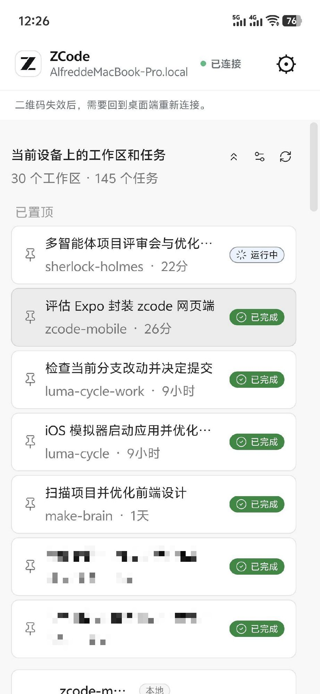
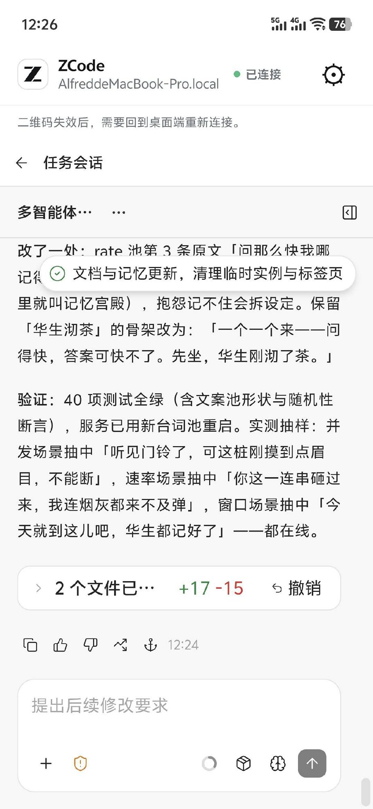
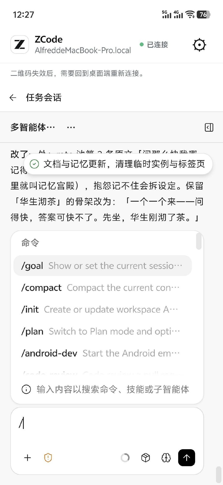
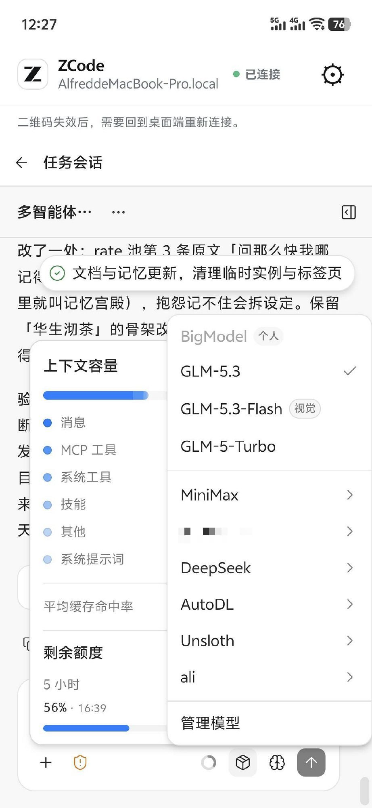

# ZCode Mobile

[简体中文](README.md) | English

[](https://github.com/AlfredChaos/zcode-mobile/releases)
[](https://github.com/AlfredChaos/zcode-mobile)
[](https://docs.expo.dev/versions/v57.0.0/)
[](LICENSE)

**[⬇️ Download the Android APK (v0.1.2)](https://github.com/AlfredChaos/zcode-mobile/releases/download/v0.1.2/app-release.apk)** · [All releases](https://github.com/AlfredChaos/zcode-mobile/releases)

> **Your desktop ZCode remote session, now on your phone.**
> ZCode Mobile is a thin iOS / Android app built with Expo: scan the QR code from ZCode Desktop's remote sync page and access `zcode.z.ai` in a secure fullscreen WebView, with a near-native mobile experience.
>
> *Pair with ZCode Desktop by QR code and drive your remote coding sessions from your phone — a thin native wrapper around the official ZCode web remote.*

| Task list | Chat session | Skills (`/`) | Models & quota |
| :---: | :---: | :---: | :---: |
|  |  |  |  |

## Table of contents

- [What it is and isn't](#what-it-is-and-isnt)
- [Installation](#installation)
- [App features](#app-features)
- [ZCode capabilities available on your phone](#zcode-capabilities-available-on-your-phone)
- [Security design](#security-design)
- [Theming](#theming)
- [Development guide](#development-guide)
- [Project structure](#project-structure)
- [Device acceptance checklist](#device-acceptance-checklist)
- [Known limitations and roadmap](#known-limitations-and-roadmap)
- [License](#license)

## What it is and isn't

- **What it is**: a native mobile shell for the ZCode web app (`zcode.z.ai/remote/v4`). It scans the QR code of a desktop remote session, loads the original page in a fullscreen WebView, and adds the safety shell a real app needs: a native header, QR pairing, settings, and disconnect controls. **The web app is the real product — this app is just a better entrance to it.**
- **What it isn't**: a reimplementation of the ZCode web app. No local AI agent, no session storage, no message stream, no push notifications, no proprietary chat protocol — and it never copies the web content or restyles it into a different UI.

## Installation

### Android (recommended)

1. Download and install [ZCode Mobile v0.1.2 (Android APK, ~118 MB)](https://github.com/AlfredChaos/zcode-mobile/releases/download/v0.1.2/app-release.apk); verify with the [SHA-256 checksum](https://github.com/AlfredChaos/zcode-mobile/releases/download/v0.1.2/app-release.apk.sha256). Older versions are listed in [Releases](https://github.com/AlfredChaos/zcode-mobile/releases).
2. Allow "install unknown apps" when prompted.
3. Open the app, start "Remote Sync" in ZCode Desktop, and scan its QR code.

### iOS

No signed iOS package is published yet. Two options:

- **Expo Go**: install [Expo Go](https://apps.apple.com/app/expo-go/id982107779) from the App Store, run `npm run start` on your computer, then scan the terminal QR code with Expo Go (same local network required).
- **Build it yourself**: with an Apple Developer account, use EAS internal distribution or a local Xcode build.

### Running from source (development)

Requires Node.js 18+. Camera scanning cannot be fully verified in a browser emulator — test on a real device. Building the Android APK locally requires JDK 17; if that's unavailable, use Expo Go.

```bash
npm install
npm run start     # Expo dev server
npm run ios       # iOS dev client
npm run android   # Android dev client
```

The app requests camera permission on first launch.

## App features

- **QR pairing**: scan the QR code shown on ZCode Desktop's remote sync page. The link must be exactly `https://zcode.z.ai/remote/v4` with non-empty `sid` and `mid` parameters — anything else is rejected.
- **Session WebView**: after a successful scan the link is saved and the remote page loads fullscreen, preserving the page's JavaScript, cookies, LocalStorage, and other session state.
- **Native header**: machine name, expired-QR notice, settings entry; colors follow the app theme.
- **Settings**: theme switching, reload the current page, re-scan to reconnect, disconnect this device (with confirmation).
- **Launch experience**: native cold start shows the ZCode logo, transitioning into an in-app pulsing animation — no blank screen.
- **Navigation guard**: Android's back button walks web history first and returns to the scanner when history runs out; the WebView only allows navigation within `zcode.z.ai`, and other HTTPS links are handed to the system browser.

## ZCode capabilities available on your phone

The app implements no chat features of its own, but nearly everything the ZCode web app offers in a remote session just works:

| Category | Capabilities |
| --- | --- |
| Chats & messages | Start / continue conversations, streaming replies, Markdown & code-block rendering, inline attachment previews, copy / resend / favorite messages |
| Projects & workspaces | Browse / switch / create projects, bind sessions to workspaces, view tasks and files per project |
| Tasks & plans | Create / edit tasks, view running and waiting-for-input states plus history, pin and sort |
| Command palette | Invoke with `⌘K` or the top bar; quick actions such as new session, switch model, open file |
| Skills | Trigger with `/` in messages; tools configured in ZCode Desktop remain available in remote sessions, with outputs and intermediate steps shown in the message stream |
| Files & attachments | Upload images / documents / code snippets and reference them in the session; view attachments generated in past sessions |
| History & search | Browse past sessions, keyword search, resume or export previous conversations |
| Desktop control | See the projects / tasks / sessions currently open on your computer; trigger desktop actions such as opening a task or switching workspaces |
| Theme & sign-in | Switch appearance from the web app's theme menu (native parts follow); reuse the desktop sign-in state and account context |

None of this is reimplemented inside the app. New capabilities added to the ZCode web app generally work as soon as the WebView can render them — no per-app adaptation needed.

## Security design

The `sid` and `mid` parameters — and the full `https://zcode.z.ai/remote/v4?sid=…&mid=…&name=…` URL — are sensitive credentials:

- Stored only in `expo-secure-store`, never in plain app storage.
- Never shown in UI, logs, test fixtures, or this README.
- Host and path must match exactly. Non-HTTPS, subdomains, custom ports, URL credentials, hash fragments, missing parameters, or malformed QR codes are all rejected.
- "Disconnect" only removes the connection from this device's secure storage; the desktop session is untouched.
- The WebView accepts only a constrained theme postMessage (dark/light + a single background color). It never reads, uploads, or forwards tasks, messages, cookies, or any other page content.

## Theming

- Three modes: **dark / light / follow web**, applied consistently across the scanner, settings, and the native session header.
- Switching drives the ZCode web app's own theme menu (Radix components) via synthesized pointer events — it never bypasses the web app's theming logic.
- The preference persists in `expo-secure-store` and survives cold starts.

## Development guide

```bash
npm run typecheck   # TypeScript static check
npm test            # all unit tests
npm run check       # typecheck + test
```

Tests cover four areas:

- **URL validation**: valid links, invisible-character cleanup, non-HTTPS, wrong host / path, missing `sid` / `mid`, ports, URL credentials, hash fragments, control characters.
- **Credential boundaries**: only the `name` parameter reaches the UI for display; other session parameters never do.
- **WebView bridge**: arbitrary page messages are rejected, only constrained theme messages are accepted; injected scripts contain literals only — no untrusted values are ever inlined.
- **DOM behavior**: hides the ZCode remote chrome without swallowing the task list, re-applies after SPA re-renders, blank-page circuit breaker, theme buttons hidden along with the banner.

## Project structure

```
app/                Expo Router routes
  _layout.tsx       Global providers, splash hand-off, status bar
  index.tsx         Entry: detect saved connection → navigate
  scanner.tsx       Camera scanning + permission guidance
  remote.tsx        Fullscreen WebView session + native header
  settings.tsx      Secondary settings page (theme, reload, disconnect)
assets/             App icons and native splash resources
components/
  zcode-mark.tsx          Logo SVG wrapper
  zcode-loading-mark.tsx  Pulsing logo for launch / loading
lib/
  connection.ts            QR URL validation + machine-name extraction
  connection-store.ts      SecureStore connection persistence
  mobile-settings.ts       Local theme preference and reload commands
  webview-bridge.ts        Injected scripts (banner hiding / theme switching / theme postMessage)
  app-theme.tsx            Global theme context
tests/
  connection.test.ts       URL security tests
  webview-bridge.test.ts   Bridge security tests
  webview-dom.test.ts      DOM behavior regression tests
```

## Device acceptance checklist

Verify on a real device that can reach the ZCode remote link:

1. After scanning a valid QR code, the remote page loads in the fullscreen WebView.
2. Streaming replies, cookies, and sign-in state work in both iOS `WKWebView` and Android WebView.
3. The software keyboard does not cover the web input area.
4. iOS back gesture and the Android system back button behave as expected.
5. Switching themes in Settings instantly recolors the native headers on the scanner, settings, and session screens, and switches the web app's own theme at the same time.
6. After the link expires, "Re-scan" restores the connection; after a network drop, "Reload" returns to the session page.

## Known limitations and roadmap

**Limitations**

- This is a thin wrapper: when the ZCode web app updates or restructures, some injected scripts may need updating. All current DOM selectors (`header.bg-header`, the intro card's `.bg-card`, the theme menu's `role="menuitemradio"`, etc.) have been verified against the real remote page.
- Theme switching relies on the Radix menu responding to pointerdown events.
- No local agent control, push notifications, account system, or full chat UI — those belong to ZCode Desktop and the web app itself.

**Roadmap**

- Once the ZCode web app supports an official mobile render mode (e.g. `?embed=mobile`), carry only the mode flag and let the web app render its own mobile UI, further reducing injection dependencies.
- Push notifications (pairing success, session expiry, new remote messages), backed by event APIs provided by ZCode.
- Native enhancements such as file pickers and clipboard bridging (dependent on the web app exposing those capabilities).

This project is not distributed on app stores and does not modify ZCode Desktop, the remote sync protocol, or the web app. Everything runs on-device — no QR content, session links, messages, or files are ever uploaded. Unofficial third-party project, not affiliated with Z.ai; the "ZCode" name and mark belong to their rightful owner. Please file feedback in [Issues](https://github.com/AlfredChaos/zcode-mobile/issues).

## License

[MIT](LICENSE)
